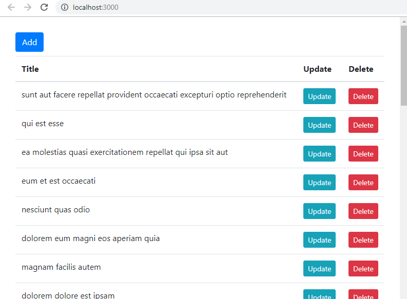
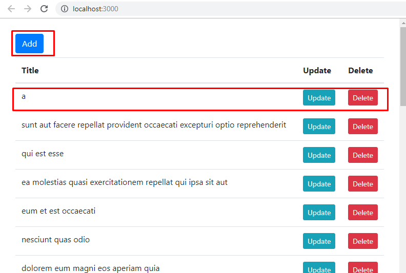
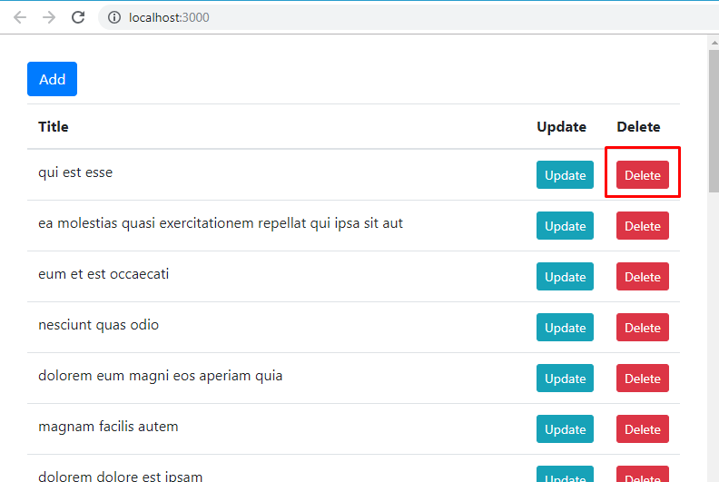
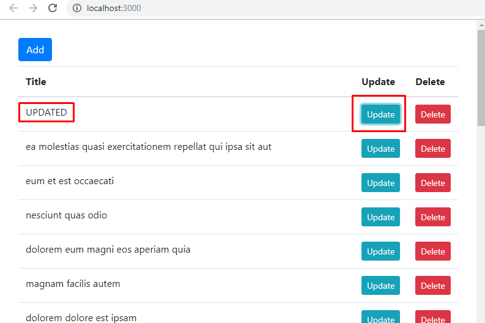
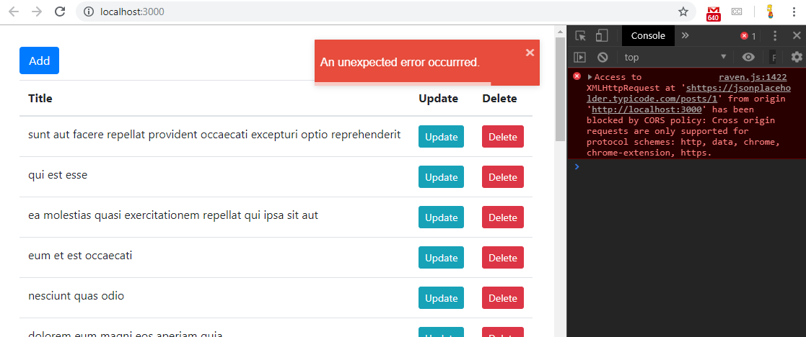
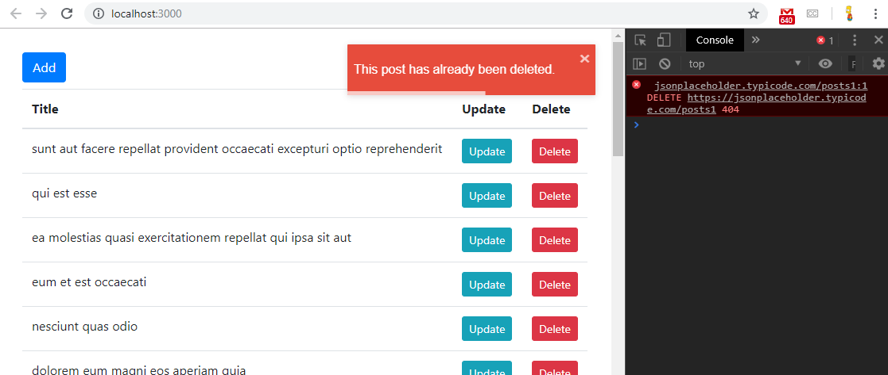
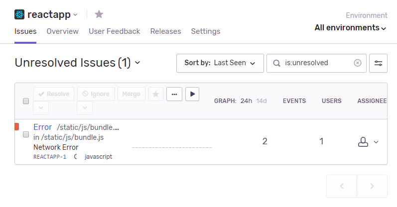

# React Basic calling backend services


## About project:

In this project I used a fake backend called jsonplaceholder https://jsonplaceholder.typicode.com json palceholder is a fake online REST API. REST stands for representational state transfer and API stands for application programming interface. So when you send an http request to https://jsonplaceholder.typicode.com/posts endpoint, you will get an array of posts. `json placeholder` gives us an api, or application programming interface. This API consists of a few endpoints like this post endpoint posts. Using these endpoints we can send http requests to these endpoints to create, read, update and delete data. We refer to this actions as CRUD operations. (CRUD operations: create, read, update, delete data). Every http request has a property called method that determines the intent of that request. The common methods we have are get, or getting data, post, for creating data, put for updating data, and delete or deleting data.<br>

In `React`, you need to send http requests to a backend to get or save data. `React` is just a simple light weight library for building user interfaces. All it cares about is rendering the new and managing the DOM. It makes sure that what we have in the browser DOM is in sync with the state of your application. `React` does not have an opinion about how to send http requests to the server, and this is one of the good things about using `React`, you can use the libraries that you prefer to send http requests in contrast, if you have worked with a framework like angular you know that in angular we have an http module for sending http requests, and if you have been programming in angular for awhile, you know that http module has had several breaking changes, and is really a pain in the neck. When using Angular, you have to do things the Angular way. But when using `React`, you have freedom, you have the ability to choose the libraries that you prefer.<br>

Well, most modern browsers have the ability to native descent http requests using the fetch api, this api was introduced in the recent years and is pretty much implemented in most, if not all modern browsers. The other option is `jQuery AJAX`. Or there is also another very popular library called `Axios`. `Axios` is a greek word which means worthy of or suitable. And it is my preferred way to send http requests in a React application. https://www.npmjs.com/package/axios<br>

`axios.get` call method use for send an http request and get some data. The first argument is the url (`https://jsonplaceholder.typicode.com/posts`). That is the url of our post endpoint. This method returns a promise. A promise is an object that holds the result of an asynchronous operation. An asynchronous operation is an operation that is going to complete in the future. So this promise object promises to hold the result of an asynchronous operation. When we create a promise initially it's in the pending state. Now when the operation completes that state will change to either result in case of success, or rejected in case of a failure.<br>

For updating data axios has two methods `axios.put` and `axios.patch`. What is the difference? `axios.patch` method use to update one or more properties, or `axios.put` to update all properties.
The first argument in this case, I updating a specific post, so it should include the post id in the url. (`https://jsonplaceholder.typicode.com/posts/` + post.id). Second argument, I need to pass the data to be sent to the server. When using the put method, I send the entire post object. If I use the patch method, I don't have to use the entire post object. I can send only one or more properties and these are the properties I want to update.<br>

For deleting data axios has method `axios.delete` where is one argument url is exactly the same url I use for updating data.<br>

In this project I created handling expected and unexpected errors. I used configuration https://sentry.io for loging unexpected errors. I used react toastify https://www.npmjs.com/package/react-toastify, component `<ToastContainer />` for show errors with automaticaly animation<br>

Expected errors that are apiEndpoints predict and return. if you try to delete a post in an invalid id, the server will return a response with a status code 404. Which means not found. This is a standard http error. As another example is the status code 400 which means bad request and this happens when you try to submit a form with invalid data. So on the server the validation fails, and the server will respond with a 400 error. All these errors are in the 400 range. In the http protocol, we refer to these errors as client errors. So errors don't happen because the client did something wrong. In this case I display a specific error message to the user. For example, in case of deleting a post, if the server returns a 404 error. I tell the user this post is already deleted. Or maybe this post would not be found. In case of a 400 error, you should tell the user what fields in the form were invalid.<br>

Unexpected errors are errors that technically should not happen under normal circumstances here are some examples. If the network is down, so this is an unexpected error because the network should not be down. This is an exceptional situation. Another example, the network might be up but maybe the server is down. Or perhaps the server is also up and running. But the database is down. Or maybe all these pieces are up and running but exist a bug in our application code.<br>

I used `axios.interceptors` for intercept response with unexpected errors. In axioswe can intercept our requests and responses and if we have a repsonse with an unexpected error we can handle that error in one place. So we can log that error and display a friendly generic error message to the user. Axios interceptors has two properties. We can intercept all our requests if we're going out, or intercept the responses we get.<br>
For intercept responses we have use method, this method takes two parameters. Like this:<br>

```js
axios.interceptors.response.use(
  successful => {
    console.log(successful);
  },
  error => {
    console.log(error);
  }
);
```

Both these parameters are functions that can be called the first function will be called if the response is successful, and the second function will be called if the response includes an error.
Intercept successful responses, it can be use for get a successful response from the server, you want to log that somewhere for auditing...<br>

```js
import axios from 'axios';
import Raven from 'raven-js';
import { toast } from 'react-toastify';
axios.interceptors.response.use(
  null, // In this case, we don't care about that so I used to null.
  error => {
    // This function will be executed everytime we have a response with an error.
    const expectedError =
      error.response &&
      error.response.status >= 400 &&
      error.response.status < 500;
    // If error.response is truthy, and error. response .status is greater than or equal to 400, and the status code is less than 500, so if you'd seen the 400 range, that means this is an expected error, we simply return a rejected promise.
    if (!expectedError) {
      Raven.captureException(error);
      toast.error('An unexpected error occurrred.'); // toast get error text and show by component `<ToastContainer />`
    }

    return Promise.reject(error); // this will create a rejected promise we simply include this error, in our promise object.
  }
);
```

if you want to display information messages to your users you can simply call the toast function otherwise you can use it as an object and call specific methods like error, info, and so on.<br>

if you want to log every unexpected error my absolute favorite is sentry service.

```js
function init() {
  Raven.config('ADD YOUR OWN API KEY', {
    release: '1-0-0',
    environment: 'development-test'
  }).install();
}

init();
```

## Content:

index:

- [./src/index.js](./src/index.js)

App:

- [./src/App.jsx](./src/App.jsx)

config:

- [./src/config.json](./src/config.json)

services/:

- [./src/services/httpService.js](./src/services/httpService.js)<br>
- [./src/services/logService.js](./src/services/logService.js)<br>

## Project screenshots:

<br>
<br>
<br>
<br>
<br>
<br>
<br>

This project was bootstrapped with [Create React App](https://github.com/facebook/create-react-app).<br>

## Available Scripts

In the project directory, you can run:

### `npm start`

Runs the app in the development mode.<br>
Open [http://localhost:3000](http://localhost:3000) to view it in the browser.

The page will reload if you make edits.<br>
You will also see any lint errors in the console.

### `npm test`

Launches the test runner in the interactive watch mode.<br>
See the section about [running tests](https://facebook.github.io/create-react-app/docs/running-tests) for more information.

### `npm run build`

Builds the app for production to the `build` folder.<br>
It correctly bundles React in production mode and optimizes the build for the best performance.

The build is minified and the filenames include the hashes.<br>
Your app is ready to be deployed!

See the section about [deployment](https://facebook.github.io/create-react-app/docs/deployment) for more information.

### `npm run eject`

**Note: this is a one-way operation. Once you `eject`, you can’t go back!**

If you aren’t satisfied with the build tool and configuration choices, you can `eject` at any time. This command will remove the single build dependency from your project.

Instead, it will copy all the configuration files and the transitive dependencies (Webpack, Babel, ESLint, etc) right into your project so you have full control over them. All of the commands except `eject` will still work, but they will point to the copied scripts so you can tweak them. At this point you’re on your own.

You don’t have to ever use `eject`. The curated feature set is suitable for small and middle deployments, and you shouldn’t feel obligated to use this feature. However we understand that this tool wouldn’t be useful if you couldn’t customize it when you are ready for it.

## Learn More

You can learn more in the [Create React App documentation](https://facebook.github.io/create-react-app/docs/getting-started).

To learn React, check out the [React documentation](https://reactjs.org/).
